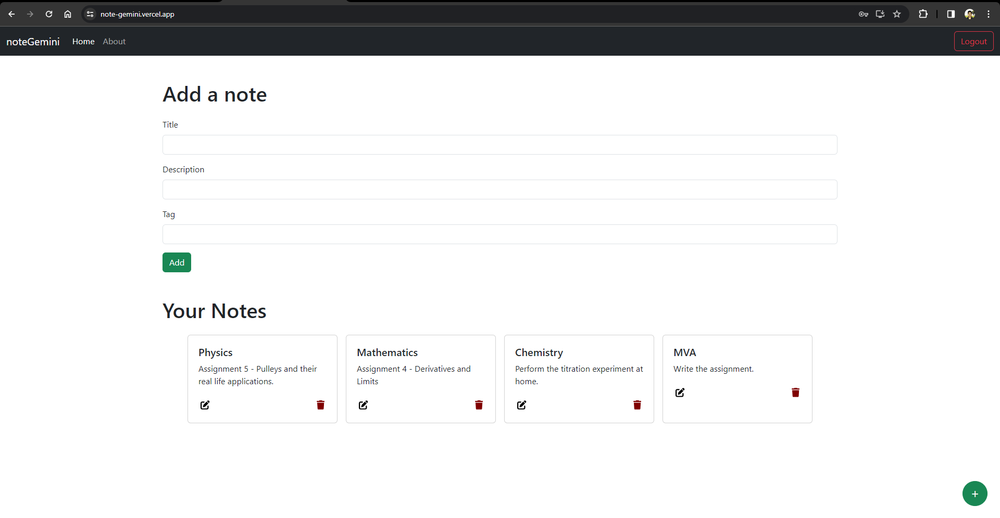

<br/>
<p align="center">
  <h3 align="center">NoteGemini</h3>

  <p align="center">
    Access your notes when & wherever you want.
    <br/>
    <br/>
    <a href="https://note-gemini.vercel.app">View Demo</a>
  </p>
</p>

## About The Project



## Built With

- JavaScript
- React
- Node.js
- Express.js
- MongoDB

## Getting Started

To get a local copy up and running follow these simple example steps.

### Prerequisites

This is an example of how to list things you need to use the software and how to install them.

- npm

```sh
npm install npm@latest -g
```

- yarn

```sh
npm install --global yarn
```

### Installation

1. Clone the repo

```sh
git clone https://github.com/sohamw03/noteGemini.git
```

2. Install packages

```sh
yarn install && cd Backend && yarn install
```

3. Enter your backend server url in `.env` file

```sh
REACT_APP_BACKEND='https://localhost:3000'
```

4. Enter your MongoDB url and JWT secret in `Backend/.env` file

```sh
JWT_SECRET="F23J678KXFJ234670HSKR937T"
MONGO_URI="mongodb://127.0.0.1/noteGemini"
```

## Usage

To start the frontend server, run

```sh
yarn start
```

To start the backend server, run

```sh
nodemon index.js
```

## Contributing

Contributions are what make the open source community such an amazing place to be learn, inspire, and create. Any contributions you make are **greatly appreciated**.

- If you have suggestions for adding or removing projects, feel free to [open an issue](https://github.com/sohamw03/noteGemini/issues/new) to discuss it, or directly create a pull request after you edit any file with necessary changes.
- Please make sure you check your spelling and grammar.
- Create individual PR for each suggestion.
- Please also read through the [Code Of Conduct](https://github.com/sohamw03/noteGemini/blob/main/CODE_OF_CONDUCT.md) before posting your first idea as well.

### Creating A Pull Request

1. Fork the Project
2. Create your Feature Branch (`git checkout -b feature/AmazingFeature`)
3. Commit your Changes (`git commit -m 'Add some AmazingFeature'`)
4. Push to the Branch (`git push origin feature/AmazingFeature`)
5. Open a Pull Request
